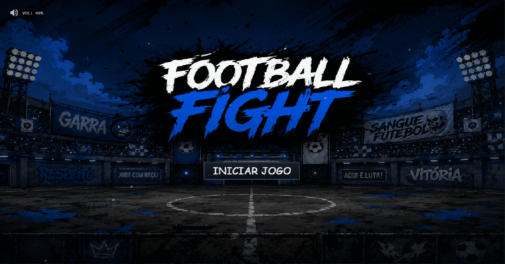
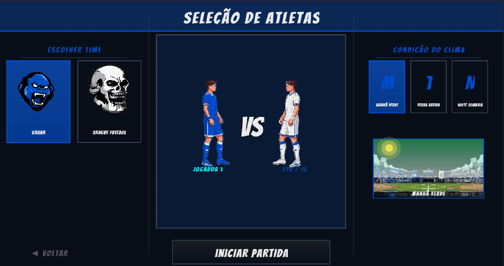
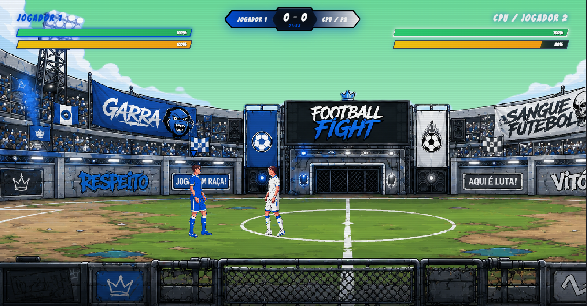

# 🎮 Football Fight

> Um jogo arcade 2D que combina futebol competitivo e combate corpo a corpo em partidas intensas, rápidas e repletas de ação.


---

# 📖 Sobre o Projeto

**Football Fight** é um jogo arcade 2D de ritmo acelerado que funde a dinâmica competitiva do futebol tradicional com a intensidade dos jogos de luta clássicos.

Ao invés de focar exclusivamente em regras esportivas e simulação realista, o jogo transforma o campo em uma arena de combate onde os jogadores podem nocautear adversários, disputar a posse da bola e utilizar ataques especiais para conquistar a vitória.

O projeto foi desenvolvido como trabalho acadêmico com o objetivo de aplicar conceitos avançados de desenvolvimento de jogos digitais utilizando **Phaser 3**, **TypeScript**, **WebGL** e técnicas de Inteligência Artificial baseadas em Máquinas de Estados Finitos (FSM).

---

# 🎯 Objetivos

* Desenvolver uma experiência híbrida de **futebol + luta arcade**.
* Implementar uma IA competitiva baseada em estados.
* Criar sistemas de combate e movimentação responsivos.
* Utilizar shaders personalizados para customização visual.
* Demonstrar conhecimentos em arquitetura de jogos orientada a cenas.
* Aplicar boas práticas de desenvolvimento utilizando TypeScript.

---

# 🕹️ Gameplay

## Mecânicas Principais

### ⚽ Futebol de Combate

Os jogadores disputam a posse da bola enquanto tentam eliminar o adversário através de golpes físicos e ataques especiais.

### 👊 Sistema de Combate

* Socos com hitboxes direcionais.
* Aplicação de dano e knockback.
* Sistema de vida individual.

### 🔥 Bola-Projétil

Ao coletar a bola, o jogador pode:

* Carregá-la.
* Transformá-la em um projétil flamejante.
* Causar dano massivo ao adversário.

### ⚡ Sistema de Estamina

As ações consomem vigor:

* Corrida
* Ataques
* Movimentações especiais

Ao esgotar a barra, o atleta entra em estado de fadiga e sofre penalidades de velocidade.

---

## Controles

| Ação                    | Tecla           |
| ----------------------- | --------------- |
| Movimentação            | WASD ou Setas   |
| Ataque / Chute Especial | Clique Esquerdo |
| Interação com Bola      | E               |

---

## Regras da Partida

* Melhor de 3 rounds.
* Cada round possui duração de 2 minutos.
* Vitória por:

  * Nocaute (vida zerada).
  * Maior pontuação ao término do tempo.

---

# 🌎 História e Ambientação

## Narrativa

Em um futuro próximo, o futebol tradicional evoluiu para um esporte extremo conhecido como **Football Fight**.

Grandes corporações clandestinas transformaram arenas esportivas em locais de combate profissional, onde atletas disputam fama, dinheiro e sobrevivência.

O jogador acompanha a trajetória de um lutador anônimo que busca ascender das ligas de rua até o campeonato mundial.

---

## Arenas

### ☀️ Manhã Verde

Campo tradicional iluminado pela luz do dia.

### 🌇 Terra Batida

Arena com efeitos de poeira.

### 🌙 Noite Sombra

Céu estrelado.

---

# 👥 Personagens

## O Gladiador

* Estilo agressivo.
* Visual robusto.
* Efeito visual de rastros sombreados.

## O Matador

* Mesmo balanceamento competitivo.
* Diferenças apenas cosméticas.


# 🏗️ Arquitetura do Projeto

```text
FOOTBALLFIGHT/
├── public/
├── scratch/
├── src/
│
├── assets/
│
├── pipelines/
│   └── UniformPipeline.ts
│
├── scenes/
│   ├── BootScene.ts
│   ├── MenuScene.ts
│   ├── UniformSelectScene.ts
│   ├── GameScene.ts
│   └── GameOverScene.ts
│
├── constantes.ts
├── estado.ts
└── main.ts

├── package.json
├── tsconfig.json
├── index.html
└── .gitignore
```

---

# ⚙️ Tecnologias Utilizadas

| Tecnologia | Finalidade                    |
| ---------- | ----------------------------- |
| Phaser 3   | Motor principal do jogo       |
| TypeScript | Desenvolvimento da lógica     |
| GLSL       | Desenvolvimento de shaders    |
| WebGL      | Renderização gráfica          |
| HTML5      | Estrutura da interface        |
| CSS3       | Estilização da HUD            |
| Node.js    | Ambiente de execução          |
| npm        | Gerenciamento de dependências |
| Git        | Controle de versão            |
        

---

# 🚀 Funcionalidades Implementadas

## Gameplay

* [x] Sistema de movimentação
* [x] Sistema de combate
* [x] Sistema de estamina
* [x] Sistema de vida
* [x] Bola-projétil especial
* [x] Melhor de 3 rounds
* [x] Sistema de pontuação

## CPU

* [x] Máquina de estados finita
* [x] Busca inteligente da bola
* [x] Comportamento ofensivo
* [x] Comportamento defensivo
* [x] Anti-tremor de decisões

## Interface

* [x] HUD de vida
* [x] HUD de estamina
* [x] Controle de volume
* [x] Tela de resultados

## Gráficos

* [x] Pipeline GLSL customizado
* [x] Recolorização dinâmica de uniformes
* [x] Ghost Effect
* [x] Slow Motion
* [x] Efeitos de iluminação

---

# 📋 Roadmap

## Versão Atual (v1.0.0)

* Gameplay completo
* IA funcional
* Sistema de combate implementado
* Sistema de rounds implementado
* Customização de uniformes
* Três ambientes visuais

# 📸 Screenshots
## Menu Principal




## Seleção de Uniforme



## Gameplay


---

# 🎨 Design do Jogo

## Estilo Visual

* Pixel Art estilizada.
* Atmosfera retro-moderna.
* Inspiração em eSports underground.

## Referências

* Street Fighter
* Inazuma Eleven
* Brawlhalla

## Diferenciais

* Futebol e luta no mesmo sistema.
* Bola utilizada como arma especial.
* IA baseada em FSM.
* Shaders customizados em tempo real.
* Efeitos cinematográficos durante super ataques.

---

# 🧪 Como Executar

## Pré-requisitos

* Node.js 16+
* npm

---

## Clonar Repositório

```bash
git clone https://github.com/herobruno/footballfight.git
```

---

## Acessar Diretório

```bash
cd footballfight
```

---

## Instalar Dependências

```bash
npm install
```

---

## Executar Ambiente de Desenvolvimento

```bash
npm run dev
```

---


# 👨‍💻 Autores

### Patrick Prestes
### Nicolle Poltosi
### Bruno Souza


---

# 🔗 Repositório

GitHub:

https://github.com/herobruno/footballfight

---

# 📄 Licença

Este projeto foi desenvolvido para fins acadêmicos e educacionais.

Caso seja disponibilizado publicamente, recomenda-se a utilização da licença MIT para incentivar estudos, reutilização e colaboração da comunidade.

---

## ⭐ Considerações Finais

Football Fight demonstra a integração entre conceitos de desenvolvimento de jogos, inteligência artificial e renderização gráfica moderna, resultando em uma experiência arcade dinâmica e visualmente marcante.

Se este projeto foi interessante para você, considere deixar uma ⭐ no repositório.
